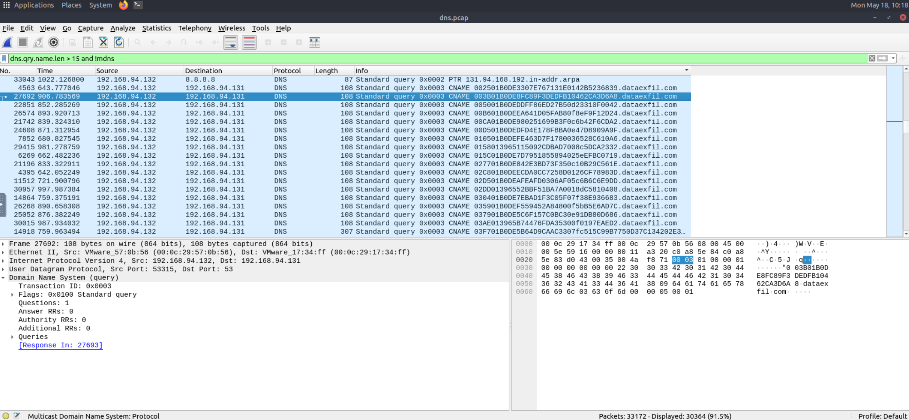

# ICMP Reconnaissance Activity (Ping Sweep)

A series of ICMP Echo Requests were observed occurring at approximately 1-second intervals.

## Observations

- Regular and automated ICMP Echo Requests
- Constant timing (~1 second interval)
- No evidence of human interaction
- Repeated probing of host availability

## Analysis

The consistent timing pattern strongly suggests automated ICMP-based host discovery (ping sweep). This technique is commonly used during the reconnaissance phase to identify live hosts in the network before launching further attacks.

## Evidence

(../Screenshots/ICMP-Analysis.png)

## Conclusion

The traffic is consistent with automated network reconnaissance activity aimed at identifying active hosts within the subnet.

# DNS Tunneling Activity (Potential Data Exfiltration)

A high volume of DNS queries was observed targeting the domain dataexfil.com.

Each query contained unusually long, structured subdomains composed of hexadecimal-like strings.

## Observations

- Multiple consecutive DNS CNAME queries
- High frequency of requests
- Consistent structured encoding pattern
- Example payloads:
  - 003B01B0DE8FC89F3DEDFB10462CA3D6A8.dataexfil.com
  - 002501B0DE3307E767131E0142B5236839.dataexfil.com

## Analysis

The observed pattern strongly indicates DNS tunneling behaviour. The subdomain structure suggests encoded or fragmented data being transmitted via DNS requests, a common technique used for data exfiltration or command-and-control (C2) communication.

## Evidence

https://github.com/rodrigoguadano/Network-Traffic-Analysis-with-Wireshark/blob/61364e9de58f32809c4250ed5a48162cf8056231/Screenshots/DNS-Tunneling.png

## Conclusion

This traffic is highly consistent with active DNS tunneling, likely used to exfiltrate data covertly from the internal network.
