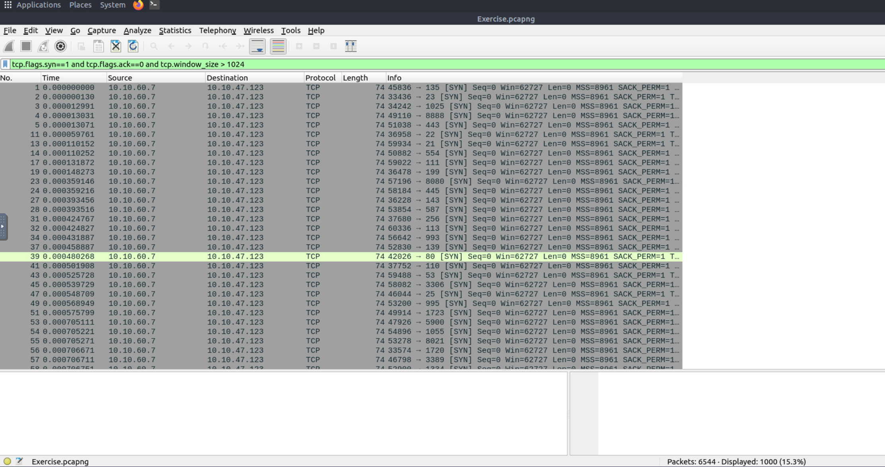

# Nmap Scan Analysis

## Objective

Identify network scanning activity using Wireshark.

## Filter Used

tcp.flags.syn==1 and tcp.flags.ack==0 and tcp.window_size > 1024

## Findings

Detected multiple TCP SYN packets originating from a single host targeting multiple ports.

### Suspicious Host

- Source IP: 10.10.60.7

### Destination IP

- 10.10.47.123

### Indicators

- Sequential port probing
- Multiple SYN packets
- TCP Connect Scan behaviour
- Possible use of Nmap

## Evidence

## Conclusion

The traffic pattern strongly indicates TCP Connect scanning activity consistent with Nmap reconnaissance.
